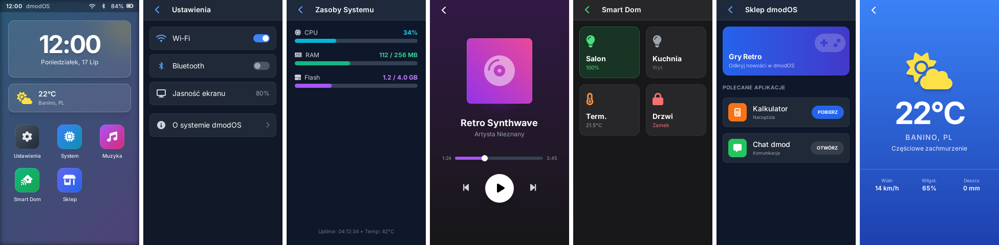

# dmodOS - a dmview example

A home screen with six applications for a 272 x 480 (portrait) display: a
clock, the weather, settings, system resources, a music player, a smart home
and a store. It reproduces a design made in HTML with Tailwind CSS -
gradients, translucent "glass" panels, text in Inter, icons from Font
Awesome - in one view, `dmodos.dmvs`.



What it shows of dmview:

- **Boxes and redraws** - a tap redraws only the box it changed (a switch, a
  light's card); the uptime and the CPU load change every second, the clock
  every minute, and redraw only themselves.
- **Gradients** - linear and radial, also as the falloff of shadows and of a
  blurred glow (CSS `box-shadow`, `drop-shadow`, `blur`).
- **Translucency** - the glass panels (`bg-white/10`), and the home screen
  dimming under an application (`OPACITY` from a variable).
- **Font files** - Inter in four weights and eight sizes, letter spacing
  (`tracking-*`) baked into the font; icons are glyphs of an icon font.
- **Handlers and timers** - applications slide in and out with an ease-out
  animation (`.timer 16`), the clock is formatted with `%02d`.

## Files

| File | |
|------|-|
| `dmodos.dmvs` | The view |
| `fonts/*.otf`, `fonts/*.ttf` | Inter (Regular, Medium, SemiBold, Bold) and the icons, cut down to the characters the view uses |
| `fonts/*.ini` | The sizes each font is made in - every section is one `.dmvf` (`size`, `chars`, `tracking`) |
| `fonts/LICENSE-*.txt` | Inter: SIL OFL 1.1; the icons: Font Awesome Free 6.4.0 (icons CC BY 4.0, font SIL OFL 1.1), renamed as the OFL asks of a modified font |

## Building and running

`apps/dmview_demo` builds it: `DMOD_ASSETS_PATHS` makes `dmod` assemble the
view with todmv and render the fonts with todmvf, into the module's views
next to each other - the view finds its fonts by their names in its own
directory. The module itself shows the view while it runs:

```
dmview_demo [<view>] [<display>]
```

It claims the display (`libdmview_claim()`), so the display's dmview
service shows the view until the program ends. Its unit,
`configs/dmview_demo.ini`, starts it at boot - in a dmod-boot flash `.dmd`:

```
dmview service=dmview@.ini
dmview rules=dmview.rules
dmview_demo service=dmview_demo.ini
```

On a landscape display (480 x 272, e.g. the STM32F746G-DISCO) dmview turns
the portrait view by 90 degrees - see the service in the main README.
